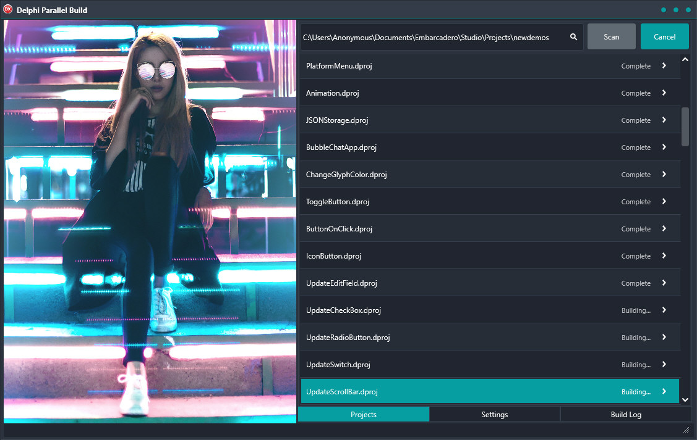

# Delphi-Parallel-Build
Build massive amount of Delphi and C++Builder projects in parallel.

---

Supports TwineCompile for C++ projects. TwineCompile doesn't support parallel building of multiple projects in parallel though so set the CPU count to 1 if TwineCompile is enabled.

---

Requires MSBuild which can be installed stand alone via:
"The latest (as of Jan 2019) stand-alone MSBuild installers can be found here: https://www.visualstudio.com/downloads/

Scroll down to "Tools for Visual Studio 2019" and choose "Build Tools for Visual Studio 2019" (despite the name, it's for users who don't want the full IDE)" - https://stackoverflow.com/questions/25506178/getting-msbuild-exe-without-installing-visual-studio

---
Built and programmed in [Delphi](https://www.embarcadero.com/products/delphi/starter).
